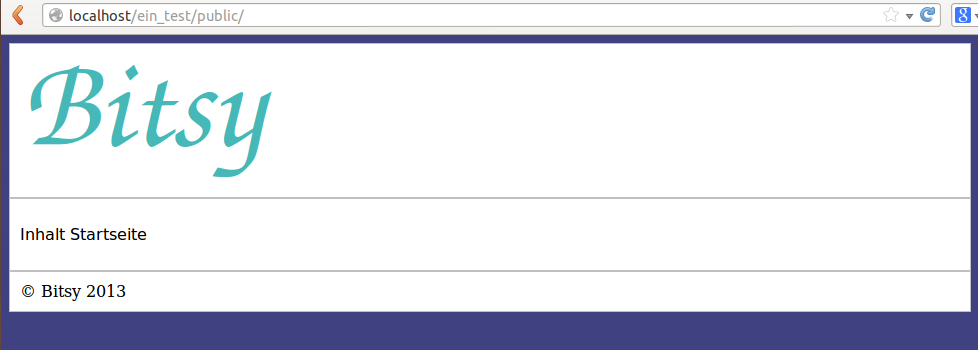

.. |date| date:: %d/%m/%Y
.. |year| date:: %Y

.. footer::
   .. class:: footertable

   +-------------------------+-------------------------+
   | Stand: |date|           | .. class:: rightalign   |
   |                         |                         |
   |                         | ###Page###/###Total###  |
   +-------------------------+-------------------------+

=============================
Bitsy - Benutzerdokumentation
=============================

.. raw:: pdf

    Spacer 0 40

.. sectnum::

.. contents:: Inhaltsverzeichnis

.. raw:: pdf

   PageBreak

Voraussetzungen
===============

Um Bitsy nutzen zu können, müssen folgende Komponenten vorhanden sein:

- ein Webserver (z.B. Apache, XAMPP)
- mindestens PHP 5.3

Installation
============

- Laden Sie das Paket herunter und entpacken Sie es in einem gewünschten Verzeichnis.
- Navigieren Sie anschließend innerhalb des Ordners zu */tmp/install.php*.
- Sie sollten nun eine Ansicht erhalten, die es Ihnen ermöglicht ein neues Projekt
  zu erstellen. Bitsy wird automatisch in das angelegte Projekt eingebunden.
- Durch Wahl der Checkboxen können Sie entscheiden, welche zusätzlichen Komponenten
  in ihr Projekt eingebunden werden.

.. raw:: pdf

    Spacer 0 20

.. class:: redbox

    **Achtung**: 
    
    Beachten Sie, dass Sie für die erfolgreiche Ausführung des Skriptes 
    die nötigen Schreibrechte für das Verzeichnis besitzen.

.. raw:: pdf

   PageBreak

Konfiguration
=============

In ihrem Projektordner befindet sich unter *config/config.ini* eine beispielhafte 
Konfigurationsdatei. In dieser werden alle wichtigen Eigenschaften Ihres Projektes
definiert.
Die *main-Sektion* ist dabei zwingend notwendig.

In dieser können folgende Eigenschaften gesetzt werden:

Main
----

+--------------+---------------------------------------------------+
| Setting      | Beschreibung                                      |
+==============+===================================================+
| project_root | Hier muss der Pfad zum Root-Ordner ihres Projektes| 
|              | hinterlegt werden. Normalerweise sollte der       |
|              | Default-Wert "../" genügen.                       |
+--------------+---------------------------------------------------+
| environment  | Die Eigenschaft environment definiert, ob sie im  |
|              | Entwicklungsmodus arbeiten oder im Live-System    |
|              | Ihrer Webanwendung.                               |
|              | Mögliche Werte sind *development* oder 		   |
|			   | *production*    								   |
|              | Die Einstellung für die jeweilige Umgebung werden |
|              | in den dafür folgenden Blöcken angegeben.         |
+--------------+---------------------------------------------------+

Sie können ebenfalls Einstellungen für die verschiedenen Produktionsumgebungen
setzen. Die Möglichkeiten können der folgenden Tabelle entnommen werden.

Umgebung development oder production
------------------------------

+--------------+---------------------------------------------------+
| Setting      | Beschreibung                                      |
+==============+===================================================+
| logger       | Hier kann zwischen *log* und *error* entschieden  |
|              | werden. Je nach Umgebung wird der entsprechenden  |
|              | Logger genutzt.                                   |
+--------------+---------------------------------------------------+
| log_file     | Falls die Eigenschaft *logger* auf log gesetzt    |
|              | wurde, werden die Einträge in der angegebenen     |
|              | Datei gespeichert.                                |
+--------------+---------------------------------------------------+
| db_user      | Hier wird der User-Name für den Datenbank-Zugriff |
|              | definiert.                                        |
+--------------+---------------------------------------------------+
| db_password  | Hier wird das Passwort für den Datenbank-Zugriff  |
|              | definiert.                                        |
+--------------+---------------------------------------------------+
| db_name      | Hier wird der Name für die genutzte Datenbank     |
|              | Ihres Projektes hinterlegt.                       |
+--------------+---------------------------------------------------+
| db_host      | Hier sollte der Host Ihrer Webanwendung           |
|              | eingetragen werden. In der Umgebung *development* |
|              | ist es in der Regel *localhost*.                  |
+--------------+---------------------------------------------------+
         

.. raw:: pdf

   PageBreak

Erster Aufruf ihres Projektes
=============================

Nachdem Sie die Installationsschritte aus Abschnitt 2 und 3 gefolgt sind,
können Sie ihr Projekt bereits einsetzen.
Navigieren Sie zu dem Verzeichnis *public* innerhalb ihres Projektordners.
(z.B. localhost/test/public)
Anschließend sollten Sie folgende Darstellung erhalten.

.. raw:: pdf

    Spacer 0 20

.. raw:: pdf

    Spacer 0 20

Falls Sie diese Startseite sehen, ist ihr Projekt bereits einsatzbereit.
Ist dieses nicht der Fall, kontrollieren Sie ggf. nochmals ihre Einstellungen
in der *config.ini* oder ob Sie einen Schreibfehler in der Url haben.

Url - Komponenten
=================

Bevor Sie nun beginnen Ihre ersten Seiten zu erstellen, sollte Sie wissen, wie
die einzelnen Komponenten der Url ihrer Webanwendung zu verstehen sind.

Betrachten wir folgende **Url: localhost/test/public/index/index**

In der Beispiel-Url repräsentiert *test* Ihr Projekt. Durch den public-Ordner wird
auf Ihre Webseite zugegriffen. Der nachfolgende Parameter *index* steht für den 
Controller.

Der darauffolgende Parameter repräsentiert die Methode innerhalb des Controllers.
Die folgende Url: **localhost/test/public/contact/send** würde demnach auf den 
ContactController zugreifen und in diesem die send-Methode aufrufen.

Ist keine Methode angegeben wie z.B. in der Url: localhost/test/public/contact, 
wird immer die index-Methode des entsprechenden Controllers ausgeführt.

Falls Parameter an die Methoden übergeben werden sollen, dann geschieht dieses 
über die bekannte Methode mittels der Zeichen **?** und **&**.
(z.B. Url: localhost/test/public/contact/send?id=5&user=user)

.. raw:: pdf

   PageBreak

Controller
==========

Da Sie die wesentlichen Eigenschaften des Routing-Verhaltens kennen, können 
Sie nun beginnen Ihre ersten eigenen Seiten zu erstellen.
Dazu benötigen Sie zunächst einen Controller.

Um z.B. eine Kontaktseite zu erstellen, implementieren wir einen Contact-Controller.
Dieser muss innerhalb des Verzeichnisses *application/controller* gespeichert werden.

Die Datei wird klein geschrieben, also *contact.php*. Die Controller-Klassen selbst
müssen alle mit dem Prefix **Controller_** beginnen.
In dem Beispiel würde die Klasse demnach Controller_Contact heißen.

Jeder Controller muss die Klasse *Bitsy_Controller_Abstract* ableiten.
Diese erfordert ebenfalls, dass alle Controller eine *index_Action* besitzen müssen.

Das Grundgerüst für eine Kontaktseite ist nun erstellt und sollte folgendermaßen 
aussehen:

.. raw:: pdf

    Spacer 0 20

.. code-block:: php
    
    <?php

    class Controller_Form extends Bitsy_Controller_Abstract 
    {

        public function index_Action() 
        {

        }
    }

.. raw:: pdf

    Spacer 0 20

Jedoch fehlt noch die View zu dem Controller. 
Wie diese erstellt wird, folgt im Kapitel 8 *Views*.

POST / GET
==========

Um Daten, welche über die POST-Methode gesandt wurden, auszulesen, bestehen zwei
Möglichkeiten.

Zum Einen können alle POST-Werte ausgelesen werden oder ein bestimmter Wert
kann durch Angabe des Namens gefiltert werden.

.. raw:: pdf

    Spacer 0 20

.. code-block:: php

    <?php

    class Controller_Form extends Bitsy_Controller_Abstract 
    {

        public function index_Action() 
        {
            $allPostValues = $this->getPost();
            $this->getView()->addContent(array("post" => $allPostValues));
        }

        public function submit_Action()
        {
            $oneValue = $this->getPostValue("Textfield-name");
            $this->getView()->addContent(array("post" => $oneValue));
        }

    }

.. raw:: pdf

    Spacer 0 20

Analog zu den Möglichkeiten POST-Werte auszulesen, existieren zwei Methoden
für Daten, welche über GET-Werte geliefert werden.

.. raw:: pdf

    Spacer 0 20

.. code-block:: php

    <?php

    class Controller_Form extends Bitsy_Controller_Abstract 
    {

        public function index_Action() 
        {
            $allGetValues = $this->getGet();
            $this->getView()->addContent(array("get" => $allGetValues));
        }

        public function submit_Action()
        {
            $oneValue = $this->getGetValue("id");
            $this->getView()->addContent(array("get" => $oneValue));
        }

    }

.. raw:: pdf

    Spacer 0 20

.. raw:: pdf

   PageBreak

Views
=====

Zu jeder Seite innerhalb ihrer Webanwendung benötigen Sie entsprechende Views,
welche ihre Daten darstellen.

Nehmen wir das Beispiel der Kontaktseite aus dem vorigen Kapiteln.
Um eine Ausgabe für diese Seite zu erzeugen, benötigen wir eine *.phtml-Datei*.
Dazu wird zunächst ein Ordner mit dem Namen des Controllers innerhalb des 
Verzeichnisses *application/views* benötigt. 
In unserem Beispiel trägt der Ordner den Namen *contact* (entsprechend des 
Controllers).
In diesem Ordner erstellen Sie nun die Datei *index.phtml*. Der Name repräsentiert
die Methode innerhalb des Contact-Controllers. Möchten Sie eine Seite für
die Methode *send* erstellen, würde die Datei dementsprechend *send.phtml* heißen.

Geben Sie der erstellten Datei folgenden Inhalt:

.. raw:: pdf

    Spacer 0 20

.. code-block:: php
    
    <h1>Kontakt</h1>
    
Dies ist der Inhalt meiner Kontaktseite

.. raw:: pdf

    Spacer 0 20

Sie sollten nun nach Navigation zu Ihrem Contact-Controller 
(z.B. Url: localhost/test/public/contact) den eingegebenen Inhalt sehen. 

Daten aus Controller an View senden
-----------------------------------

Um nun dynamisch Daten aus dem Controller heraus an die View senden zu können, 
steht folgende Funktionen bereit.

.. raw:: pdf

    Spacer 0 20

.. code-block:: php
    
    <?php

    class Controller_Contact extends Bitsy_Controller_Abstract 
    {

        public function index_Action() 
        {
            //inhalt, der an view gesendet werden soll
            $content = 'Hier ist mein Inhalt !';

            $this->getView()->addContent(array("content" => $content));
        }
    }

.. raw:: pdf

    Spacer 0 20

Durch die Methode *addContent* wird ein Array mit Variablen an die View
gesendet. Anstelle von einer Variablen, können ebenfalls mehrere Inhalte mit einem 
Aufruf weitergeleitet werden.

Innerhalb der View kann mittels der nachfolgenden Methode auf die Variablen
zugegriffen werden:

.. raw:: pdf

    Spacer 0 20

.. code-block:: php
    
    <h1>Kontakt</h1>
    
Dies ist der Inhalt meiner Kontaktseite

    
    <?php echo $this->content; ?>

.. raw:: pdf

    Spacer 0 20

.. raw:: pdf

   PageBreak

Templates
=========

Die Daten, welche durch den Controller an die View gesendet werden (siehe 
voriges Kapitel), können ebenfalls durch Templates formatiert werden.

Eine beispielhafte Formatierung wäre die Ausgabe von Datums-Objekten.
Hierfür wird innerhalb des Controllers die Methode *useTemplate* benutzt:

.. raw:: pdf

    Spacer 0 20

.. code-block:: php
    
    <?php

    class Controller_Index extends Bitsy_Controller_Abstract 
    {

        public function index_Action() 
        {
            $variableInhalt = 'content for template';

            // nutzt template 'date.phtml' um variable mit dem 
            //übergebenen inhalt zu formatieren
            $helperTest = $this->getView()
                               ->useTemplate('date', array("variable" => $variableInhalt));

            // formatierte variable wird an view übergeben
            $this->getView()->addContent(array(
                "text"      => $helperTest
                ));
        }
    }

.. raw:: pdf

    Spacer 0 20

Das Template, welches benutzt wird, trägt hier den Namen date.
Durch das übergebene Array wird angegeben, wie die Variable innerhalb des Templates
anzusprechen ist. Hier kann über *variable* auf den Inhalt zugegriffen werden.

Um ein Template zu nutzen, muss dieses zunächst in dem Ordner *templates* in
ihrem Projekt-Ordner erstellt werden.
Eine beispielhafte Implementierung sieht wie folgt aus:

.. raw:: pdf

    Spacer 0 20

.. code-block:: php

    <h1>Das Date Template : <?php echo $this->variable; ?></h1>

.. raw:: pdf

    Spacer 0 20

Layouts
=======

Für Ihre Webanwendung können Sie verschiedene Layouts definieren.
Standardmäßig sind bereits Layouts für die Standard- sowie für die mobile 
Ausgabe enthalten.
Zu finden sind diese in dem Ordner *layouts*.
In diesem können Sie beliebig viele weitere Layouts erstellen.

Um ein Layout zu wechseln, muss innerhalb des Controllers der Aufruf der 
Methode *setLayout* erfolgen.
Die View wird dann mit dem entsprechendem Layout dargestellt.

.. raw:: pdf

    Spacer 0 20

.. code-block:: php

    <?php

    class Controller_Test extends Bitsy_Controller_Abstract 
    {
        public function help_Action() 
        {
            //ändert das layout für diese view
            $this->setLayout('mobile');
            $content = 'test';
            $this->getView()->addContent(array("text" => $content));
        }
    }

.. raw:: pdf

    Spacer 0 20

.. raw:: pdf

   PageBreak

Models
======

Models dienen als Klassen für die Verwaltung von Einträgen in Datenbanken.
Die Verbindungsdaten für den Datenbankzugriff werden in der *config.ini* für
die entsprechende Produktionsumgebung festgelegt (siehe Kapitel 3).

Jedes Model besitzt eine eigene Klasse innerhalb des Verzeichnisses 
*application/model*. Der Dateiname sollte klein geschrieben werden.
Der Klassenname jedoch, muss immer mit dem Prefix **Model_** beginnen.

Innerhalb des Models kann durch die Angabe der Variablen *_table* der 
Name der Datenbanktabelle definiert werden.

Jedes Model muss die Klasse *Bitsy_Model_Abstract* ableiten und im Konstruktor
*parent::__construct()* aufrufen.

.. raw:: pdf

    Spacer 0 20

.. code-block:: php

    <?php

    class Model_User extends Bitsy_Model_Abstract 
    {

        protected $_table = "users";

        public function __construct() 
        {
            parent::__construct();
        }

    }

.. raw:: pdf

    Spacer 0 20

Daten aus Datenbank lesen
-------------------------

Zum Lesen von Datenbankeinträgen stehen derzeit nur wenige Methoden zur 
Verfügung.
Zunächst gibt es die Funktion *getData()*. Diese ermöglicht es entweder alle 
Einträge einer Tabelle auszulesen oder nur eine bestimmte Spalte.

Nachfolgend ist die Anwendung beider Methoden verdeutlicht.

.. raw:: pdf

    Spacer 0 20

.. code-block:: php

    <?php

    class Model_User extends Bitsy_Model_Abstract 
    {

        protected $_table = "users";

        public function __construct() 
        {
            parent::__construct();
        }

        public function getMessages() 
        {
            return $this->getData('message'); 
        }

        public function getAllUsers()
        {
            return $this->getData();
        }

    }

.. raw:: pdf

    Spacer 0 20

Neben dem Auslesen ganzer Tabellen, können auch einzelne Zeilen entnommen werden.
Diese können derzeit nur nach der ID gefiltert werden.
Dazu kann die Methode *getDataById()* genutzt werden.

.. raw:: pdf

    Spacer 0 20

.. code-block:: php

    <?php

    class Model_User extends Bitsy_Model_Abstract 
    {

        protected $_table = "users";

        public function __construct() 
        {
            parent::__construct();
        }

        public function getRowById($id)
        {
            return $this->getDataById($id);
        }

    }

.. raw:: pdf

    Spacer 0 20

Daten in Datenbank schreiben
----------------------------

Zum Schreiben eines neuen Datenbanksatzes gibt es die Methode *insertRow()*.
Dieser wird ein Array mit den Spalten und den dazugehörigen Werten übergeben.

Innerhalb eines Controllers sieht die Anwendung wie folgt aus:

.. raw:: pdf

    Spacer 0 20

.. code-block:: php
    
    <?php

    class Controller_Test extends Bitsy_Controller_Abstract 
    {
        public function index_Action() 
        {
            $model = new Model_User();

            $model->insertRow(array(
                'message'   => 'haha',
                'name'      =>  'test'));
        }
    }

.. raw:: pdf

    Spacer 0 20

.. raw:: pdf

   PageBreak

Formulare
=========

Um Formulare zu generieren, eignet es sich für jede Form eine eigene Klasse
innerhalb des Verzeichnisses *application/form* zu erstellen.

Für ein Kontaktformular würde die Datei *contact.php* heißen. Die Klasse selbst
muss den Prefix **Form_** tragen. Es ergibt sich der Name Form_Contact für die 
Klasse. 
Des Weiteren muss diese die Klasse *Bitsy_Form_Abstract* ableiten.

Im Controller wird ein Formular wie folgt aufgerufen:

.. raw:: pdf

    Spacer 0 20

.. code-block:: php

    <?php

    class Controller_Contact extends Bitsy_Controller_Abstract 
    {

        public function index_Action() 
        {
            $form = new Form_Contact();
            $this->getView()->addContent(array("form" => $form));
        }

    }

.. raw:: pdf

    Spacer 0 20

Die Klasse Form_Contact könnte folgenden Inhalt enthalten:

.. raw:: pdf

    Spacer 0 20

.. code-block:: php

    <?php

    class Form_Contact extends Bitsy_Form_Abstract 
    {

        function __construct() 
        {
            $this->setClass("test_form")
                    ->setId("test_form")
                    ->setMethod("post")
                    ->setAction("contact/submit");
            $this->initTextfield();
            $this->initButtons();
        }

        public function initTextfield() 
        {
            $textfield = new Bitsy_Form_Element_Input_Textfield();
            $textfield->setLabel("Label: ")
                    ->setName('Textfield-name')
                    ->setValue("vordefinierter Wert")
                    ->setSize(50)
                    ->setRequired()
                    ->setPlaceholder("Geben Sie etwas ein");
            $this->addElement($textfield);
        }

        public function initButtons() 
        {
            $button = new Bitsy_Form_Element_Button();
            $button->setValue('Label')->setType("submit");
            $this->addElement($button);
        }

    }

.. raw:: pdf

    Spacer 0 20

Für Formulare sind bereits einige Elemente implementiert, wie beispielsweise

- Buttons
- RadioButtons
- Checkboxes
- Textareas
- Input-Elemente (Number, Range, Passwort, Email, Text, Url)
- Fieldset

Diese können analog zu dem oberen Beispiel eingebunden werden.

